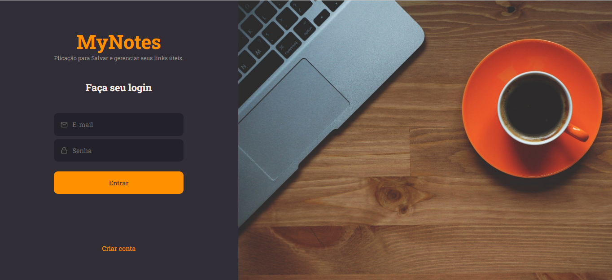
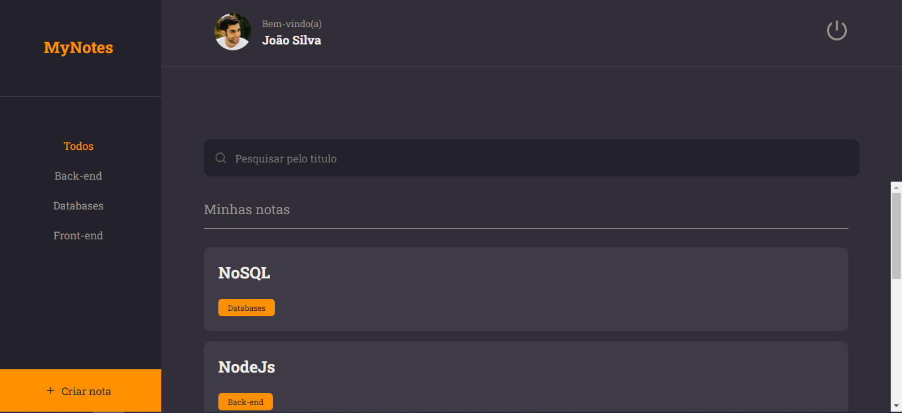
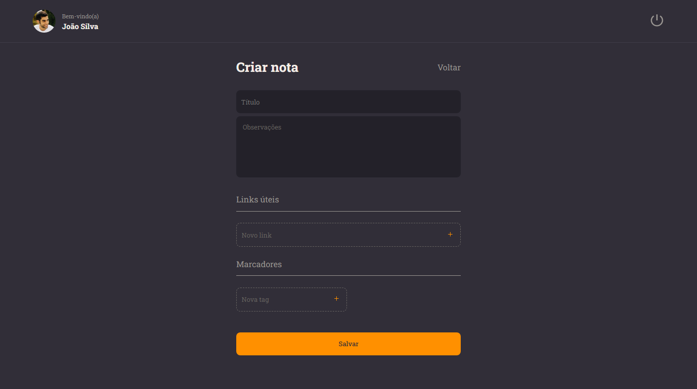
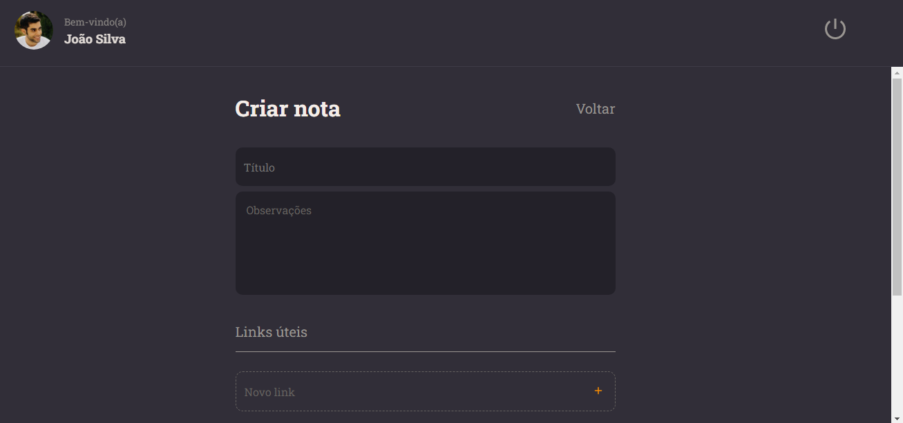

<h1 align="center">MyNotes</h1>

# Readme

Pagina desenvolvido para fins de estudo.

# Features
- [x] Hooks
- [x] Validações de formularios
- [x] Rotas
- [x] Conexão com API
- [x] Styled components
- [x] Manipulação de estado
- [x] componentização

<h1>
    
</h1>

<h1>
    
</h1>

<h1>
    
</h1>

<h1>
    
</h1>

<h1>
    
</h1>

<h1>
    
</h1>

# Prerequisites
To get started you need to have the [Git](https://git-scm.com/) and NodeJS tools installed on your machine. You also need an editor to work with code like [VSCode](https://code.visualstudio.com/).

### Technologies
- ReactJS
- Styled-components
- NodeJS
- JavaScript

---

Made by GUTEMBERG OLIVEIRA. - [See my linkedin.](https://www.linkedin.com/in/gutemberg-oliveira-61a1b1116/)
